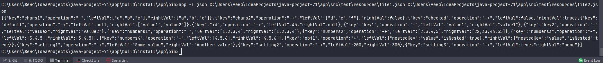

##### Maintainability:

##### Test Coverage:

##### Build status:

##### Hexlet tests and linter status:

## Проект "Вычислитель отличий"
Приложение умеет работать с файлами формата JSON и YAML.  
Реализован вывод в трех форматах: stylish (по умолчанию), plain и json.  
Формат указывается через необязательный флаг -f.  
Пример:  
*app -f plain C:\Users\Женя\IdeaProjects\java-project-71\app\src\test\resources\file1.json C:\Users\Женя\IdeaProjects\java-project-71\app\src\test\resources\file2.json*

##### Скриншоты работы приложения:

